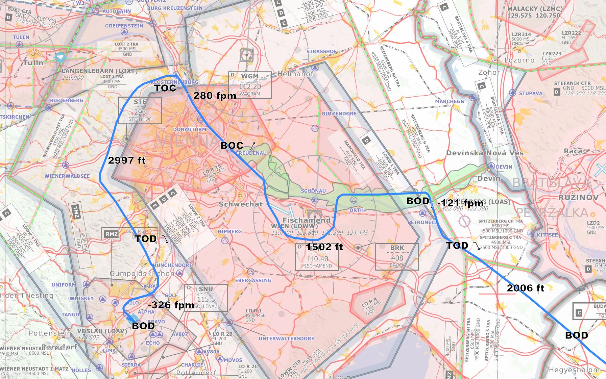
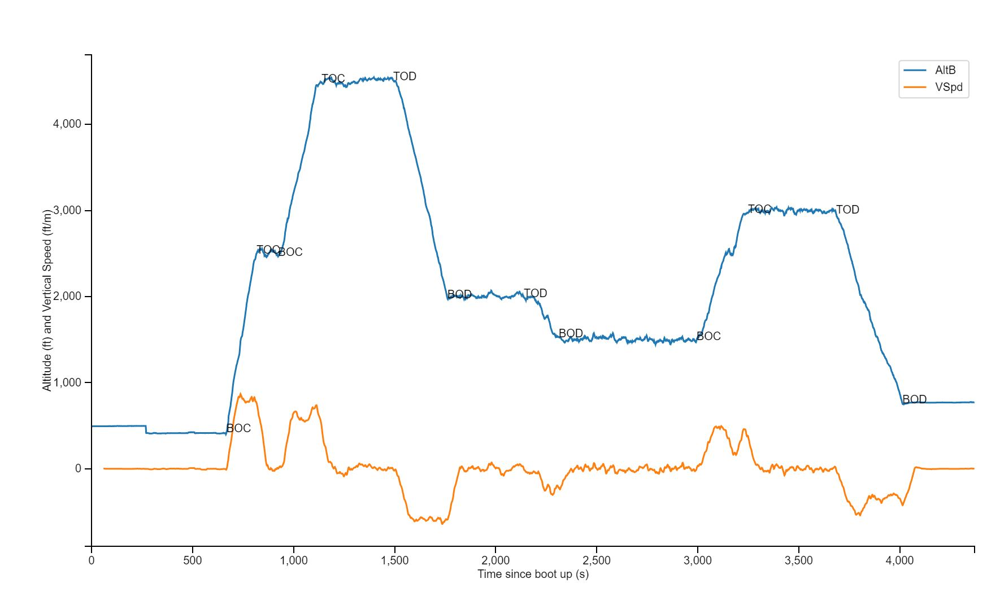

  

The goal of this project is the development of an angular application which allows pilots to analyze 
flight data recordings made using EFIS instruments. Currently the G1000 will be supported. 

___ 
THE SOFTWARE IS PROVIDED "AS IS", WITHOUT WARRANTY OF ANY KIND, EXPRESS OR IMPLIED, INCLUDING BUT NOT LIMITED TO THE WARRANTIES OF MERCHANTABILITY, FITNESS FOR A PARTICULAR PURPOSE AND NONINFRINGEMENT. IN NO EVENT SHALL THE AUTHORS BE LIABLE FOR ANY CLAIM, DAMAGES OR OTHER LIABILITY, WHETHER IN AN ACTION OF CONTRACT, TORT OR OTHERWISE, ARISING FROM, OUT OF OR IN CONNECTION WITH THE SOFTWARE OR THE USE OR OTHER DEALINGS IN THE SOFTWARE.

THIS SOFTWARE IS NOT AN OFFICIAL BRIEFING SOURCE. ANY DATA SENT MIGHT BE WRONG, OUT OF DATE OR OTHERWISE UNUSABLE OR MISLEADING, NO GUARANTEES CAN BE MADE ABOUT THE AVAILABILITY OF THIS SERVICE, ESPECIALLY THE POLLING/SUBSCRIPTION MECHANISM
USE PURELY AT YOUR OWN RISK!
___

## Data 
EFISP will allow the user to plot barometric altitude, indicated airspeed, power settings and more. 

## Map Display
The flight itself will be shown on a map which will be segmented by either cruise, climb or descent segments 
where cruise segments display the mean altitude and climb as well as descend segments show the mean climb/descend rate.

## Flight Phase Segmentation
Altitudes are segmented using the rolling mean of the barometric climb rate. 

### Prototype Map Display
A prototype has been created using a python leaflet.js API.

    

### Segmentation Algorithm
Segmentation in the prototype is performed by applying a rolling mean with a 60 second window on the barometric
vertical speed. 

    

For each time step the current state is saved where `cruise` is the initial state. 

If the current state is `cruise` and a change of more than 250ft/m is detected the current state will be changed to 
either `climb` or `descend`, based upon the sign of the climb rate. The TOD or BOC will be set at the last point in 
time where the vertical speed was still below the zero detection limit \epsilon_0 of 5 ft/m. 

If the current state is not `cruise` and the vertical speed falls below the zero detection limit of 5 ft/m the state
will be changed to `cruise` and a BOD or TOC will be set at the point 60s before the detection. 
